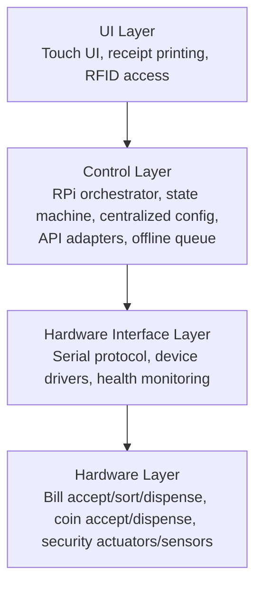

# Coinnect Architecture

> Scope: System-level architecture for the Coinnect kiosk (hardware + firmware + Raspberry Pi application + cloud integrations).  
> Non-goals for this doc: pin numbers, wiring diagrams, full algorithms, UI layouts, or code.

## Overview

Coinnect is a self-service financial kiosk for secure **cash-in / cash-out** and **money conversion**. The system is designed so that core hardware control is local, with connectivity required only for **e-wallet transactions** and **foreign exchange**.

**Offline policy (confirmed):**

- When **offline**: only the **money-changer** mode is available (PHP cash-to-cash conversion limited to coin<->bill and bill<->bill).
- When **online**: enable **e-wallet transactions** (cash-in/cash-out) and **foreign exchange** flows.

At a high level, Coinnect uses a **hybrid controller architecture**:

- **Raspberry Pi 4/5 (Main Controller)**: UI, transaction orchestration, bill authentication (camera + ML), printing, local persistence, RFID access control, and cloud/API calls.
- **Arduino Mega #1 (Bill Controller)**: bill sorting (linear rail + stepper) and bill dispensing (multi-unit dispenser array).
- **Arduino Mega #2 (Coin & Security Controller)**: coin acceptance, coin dispensing, and security/tamper hardware (solenoid, shock sensors).

This separation isolates faults (security/coin can remain active if bill subsystems fail), avoids resource conflicts, and enables parallel operations.

## Architecture Diagrams

### System Context

```mermaid
flowchart LR
  User((User)) -->|touch + cash| Kiosk[Coinnect Kiosk]
  Kiosk -->|cash-out/cash-in requests| APIs[Cloud/APIs\n(GCash/Maya/Payments/Exchange/Telemetry)]
  Tech((Technician)) -->|RFID Card| Kiosk
```

### High-Level Components

```mermaid
flowchart TB
  subgraph K[Coinnect Kiosk]
    UI[Touch UI + Printer\n(Raspberry Pi)]
    ORCH[Transaction Orchestrator\n(Raspberry Pi)]
    ML[Bill Auth + Denom ID\n(Camera + ML on RPi)]
    RFID[RFID Reader\n(USB to RPi)]
    PERSIST[(Local Store\n(offline logs, inventory, receipts))]

    BILL[Arduino Mega #1\nBill Controller]
    COINSEC[Arduino Mega #2\nCoin + Security Controller]

    ACCEPT[Bill Acceptor Mechanics\n(motor + sensors + LEDs)]
    SORT[Bill Sorting Mechanism\n(linear rail + storage slots)]
    DISP[Bill Dispensers\n(12 units + validation sensors)]
    COINACC[Coin Acceptor Module]
    COINDISP[Coin Dispensers\n(servos + tubes)]
    SEC[Security Hardware\n(shock sensors, lock, indicators)]
  end

  UI <--> ORCH
  ORCH <--> ML
  ORCH <--> RFID
  ORCH <--> PERSIST

  ORCH <--> |USB Serial (JSON)| BILL
  ORCH <--> |USB Serial (JSON)| COINSEC

  ML <--> ACCEPT
  BILL --> SORT
  BILL --> DISP
  COINSEC --> COINACC
  COINSEC --> COINDISP
  COINSEC --> SEC

  ORCH <--> APIs
```

### Layered Architecture (Conceptual)



## Layer Definitions

### UI Layer

Responsibilities:

- User flow: select service (cash-in/cash-out/conversion), confirm amounts, show progress/errors.
- Receipt output via thermal printer.
- **Access Control:** Reading RFID cards for technician/admin authentication.
- Operator/maintenance screens (status, inventory, diagnostics, audit export).

Key concerns:

- Clear "what is happening now" feedback during mechanical operations (timeouts/jams).
- Accessibility and "public kiosk" hardening (timeouts, screen lock, minimal text entry).

### Control Layer (Raspberry Pi Application)

Responsibilities:

- Transaction orchestration across cash hardware and external APIs.
- Offline-first ledgering: durable transaction logs, inventory deltas, and receipts.
- **Centralized Configuration:** Stores all hardware thresholds (servo angles, sensor triggers) and pushes them to Arduinos on connection.
- Policy decisions: when to accept cash, when to lock down, how to handle partial failures.
- Exchange-rate and payment provider adapters (GCash/Maya/etc.).

Key concerns:

- **Power Loss Recovery:** No UPS is present. Recovery relies on "crash-only" software design (write-ahead logging) and hardware homing sequences on boot.
- Idempotency and recovery after power loss (resume / rollback / safe-stop).
- Deterministic state machine per transaction (prevents "double dispense").
- Unified health model (devices, connectivity, tamper state).

### Hardware Interface Layer

Responsibilities:

- USB Serial management to both Arduinos (framing, retries, timeouts).
- Normalization of device events into a common event bus (e.g., READY, JAM, COIN_IN, TAMPER).
- Device capability and version negotiation.

Key concerns:

- Explicit timeouts and cancellation semantics for long-running operations.
- Backpressure: avoid sending overlapping commands that create unsafe motion.

### Hardware Layer

Responsibilities:

- Execute motor/actuator control loops and read sensors.
- Enforce local safety rules (stop on jam/timeout/tamper).
- Emit real-time events to RPi.
- **No Deadman Switch:** Mechanisms will not automatically lock/halt solely on serial disconnect; they wait for explicit commands or local sensor faults.

Key concerns:

- Fail-safe defaults (lock on tamper; stop motion on fault).
- Independent operation of coin/security subsystem.

## Module Breakdown

### Raspberry Pi (Main Controller)

Suggested modules (logical):

- **UI/UX module**: screens, prompts, progress indicators, receipt rendering.
- **Transaction Orchestrator**: state machine coordinating acceptance, verification, sorting, and dispensing.
- **Bill Authentication Service**: camera capture, UV/white lighting control, ML inference, confidence thresholds.
- **Device Gateway**: manages serial connections, command/response, event ingestion.
- **Inventory & Ledger**: bill/coin counts, dispenser availability, audit trail, reconciliation utilities.
- **Persistence (Local Today, DB Later)**: embedded local datastore.
- **Connectivity Manager**: online/offline detection, queued API calls, retry/backoff.
- **Security Supervisor**: manages RFID usage, consumes tamper events, triggers lockdown, governs maintenance mode.
- **Telemetry/Logging**: local logs + basic cloud telemetry (health status, transaction summaries, alerts) when online.
- **Receipt Printer Driver**: ESC/POS protocol driver for thermal receipt printing.
- **Consumables Monitor**: tracks receipt paper level, storage slot fullness, dispenser levels; triggers remote alerts to technician.
- **Claim Ticket Generator**: creates unique claim codes for partial dispense failures.

### Arduino Mega #1 (Bill Controller)

Responsibilities:

- **Bill Sorting**: home/position linear rail and align target slot for drop.
- **Bill Dispensing**: command-driven dispense per denomination, validate via sensors, return counts/faults.
- **Bill-side safety**: detect jams/empty conditions, expose readiness per dispenser.

### Arduino Mega #2 (Coin & Security Controller)

Responsibilities:

- **Coin Acceptance**: interpret acceptor output (accepted-denom events), keep running totals for session.
- **Coin Dispensing**: dispense requested coin counts; optionally compute change breakdown for an amount.
- **Security**: tamper detection (shock sensors), solenoid lock control, indicator LEDs.
- **Security-side fault isolation**: remain active and enforce lockout even if other subsystems fail.

## Data Flow (End-to-End)

### A) Cash-In (Bills) to E-Wallet

1. User selects cash-in and provider (e.g., GCash/Maya); enters account reference.
2. RPi starts a transaction session locally (ledger "pending").
3. User inserts bill(s).
4. RPi bill acceptor subsystem detects entry/position, captures images under controlled lighting, runs ML authentication + denomination.
5. If accepted, RPi commands Arduino #1 to align the correct sorting slot.
6. Arduino #1 signals READY; RPi drives acceptor motor to route bill into the aligned slot.
7. RPi updates local inventory and session total; UI displays updated amount.
8. On user confirmation, RPi calls provider API(s) to credit wallet (online required; blocked when offline).
9. On success, RPi finalizes ledger, prints receipt, and optionally syncs logs/telemetry.
10. On API failure, RPi aborts the transaction and records an incident; funds handling policy should be explicitly defined before deployment.

### B) Cash-Out (E-Wallet) to Cash (Bills + Coins)

1. User selects cash-out and provider; requests amount.
2. RPi validates kiosk capability (inventory available, devices ready, not in tamper/lockdown).
3. RPi calls provider API(s) to authorize/debit (online required; blocked when offline).
4. RPi computes a dispense plan (bills first, then coins for remainder) and reserves inventory locally.
5. RPi commands Arduino #1 to dispense bills by denomination; monitors status/faults.
6. If needed, RPi commands Arduino #2 to dispense coins for exact change.
7. RPi confirms completion, prints receipt, finalizes ledger, and records inventory deltas.
8. If a dispense fault occurs after debit, RPi generates a **claim ticket** with a unique code, prints it (if possible), displays the code on-screen, and records the incident for customer service resolution.

### C) Money Conversion (Bill<->Bill, Coin<->Bill)

1. User selects conversion direction and target currency/denomination constraints.
2. RPi collects input funds (bill acceptor and/or coin acceptor) and tallies locally.
3. If conversion involves **foreign exchange**, RPi requires online connectivity to fetch/confirm rates (blocked when offline).
4. If conversion is the **offline money-changer** mode (PHP cash-to-cash only), RPi uses local rules and proceeds without external calls. Supported offline conversions are limited to coin<->bill and bill<->bill.
5. RPi computes output plan (bill dispensers + coin change).
6. RPi dispenses outputs; finalizes ledger and prints receipt.

### D) Tamper / Lockdown / Maintenance Flow

1. **Tamper Event:** Arduino #2 detects shock/vibration.
2. Arduino #2 enters LOCKDOWN (engages solenoid lock, sets red LED) and sends `TAMPER` event to RPi.
3. RPi halts active transactions, logs incident, and displays "Out of Service" UI.
4. **Maintenance Access:** Technician scans **RFID Card** (connected to RPi).
5. RPi verifies card against local authorized list.
6. RPi sends `SECURITY_UNLOCK` command to Arduino #2.
7. Arduino #2 unlocks solenoid and updates LEDs (Green).
8. RPi enters Maintenance UI (inventory management, diagnostics).
9. Technician creates access; when finished, RPi sends `SECURITY_LOCK` to re-arm.

## Reliability & Safety Boundaries

Recommended design boundaries (hardware + software):

- **No implicit motion**: all motors/actuators move only under an explicit command in a known state.
- **Inventory reservation**: reserve before dispense; reconcile after dispense; never "assume success."
- **Idempotent external calls**: provider API calls should be retriable without double-charging.
- **Power-loss recovery**: Since no UPS is used, the system must assume power can cut at any moment.
  - Transaction log is append-only (write-ahead).
  - On boot, software reconciles "pending" logs.
  - Hardware runs a **homing sequence** on boot/connect to establish known physical states.
- **Security precedence**: tamper/lockdown overrides all other operations.

## Operational Policies

### Transaction Limits

- **No transaction limits** (prototype phase). The only constraint is inventory availability.
- Regulatory compliance (BSP, AML/KYC) is deferred until production deployment.

### Bill Authentication Failures

- **Always reject** bills with uncertain ML confidence (below threshold).
- Return rejected bill to user immediately via the rejection mechanism.
- User may retry with the same bill or use a different one.

### Partial Dispense Failures

- If dispensing fails mid-transaction (e.g., jam after partial output):
  - Generate a **claim ticket** with a unique alphanumeric code.
  - Print the claim ticket (if printer functional) and display code on-screen.
  - Log incident details: transaction ID, requested amount, dispensed amount, timestamp.
  - User contacts customer service with claim code for resolution.

### Bill Jam Recovery

- **Manual intervention only.** On jam detection:
  - System enters lockdown state.
  - Display "Out of Service - Please contact staff" message.
  - Wait for technician to physically clear jam and reset via maintenance mode.
  - No automatic retry or reverse motion attempts.

### Session Timeout Behavior

- **Smart timeout** with stage-aware durations:
  - Service selection screen: 60 seconds
  - Waiting for cash insertion: 120 seconds (longer to allow bill feeding)
  - Confirmation screens: 45 seconds
  - Processing screens: No timeout (operation-driven)
- Show countdown warning 15 seconds before timeout.
- On timeout: cancel transaction gracefully, return to attract screen.

### Storage Slot Capacity

- **Alert-only policy**: When a storage slot approaches capacity (~80% full), send alert to technician.
- Continue accepting bills for that denomination until slot is physically full.
- When slot is full, disable acceptance for that specific denomination only.

## Monitoring & Alerting

### Consumables Tracking

The system monitors and reports on:

- **Receipt paper level**: Low paper sensor triggers alert.
- **Storage slot fullness**: Estimated count per slot, alert at threshold.
- **Dispenser levels**: Bill/coin counts per denomination, low inventory alerts.

### Remote Alerts

- Push notifications to technician (mobile app or dashboard) for:
  - Low consumables (paper, inventory)
  - Hardware faults (jams, sensor failures)
  - Security events (tamper, lockdown)
  - Transaction anomalies (high failure rate)

### Basic Telemetry

When online, the system sends:

- Periodic health heartbeats (device status, connectivity)
- Transaction summaries (counts, amounts, success/failure rates)
- Alert events (immediate push on critical issues)

## Localization

- **Bilingual UI**: Filipino (Tagalog) and English.
- User can switch language at any point during a session.
- All user-facing text, prompts, and error messages support both languages.
- Receipt content follows user's selected language.

## Interfaces & Contracts

### Frontend <-> Backend (HTTP + WebSocket)

The React frontend communicates with the Python FastAPI backend over local HTTP and WebSocket connections. Both run on the same Raspberry Pi.

**Architecture Pattern:** Backend-authoritative state management.

- The backend maintains the transaction state machine and is the single source of truth.
- The frontend is a thin display layer that reflects backend state.
- All hardware commands flow through the backend; the frontend never talks directly to Arduinos.

**REST API (HTTP):**

- Base URL: `http://localhost:8000/api/v1`
- Used for: starting transactions, user confirmations, fetching static data (rates, inventory status).
- No authentication required (trusted local environment).

**WebSocket (Real-time Events):**

- Endpoint: `ws://localhost:8000/ws`
- Used for: pushing hardware events and state changes to the frontend in real-time.
- Events include: `BILL_INSERTED`, `BILL_AUTHENTICATED`, `BILL_REJECTED`, `COIN_INSERTED`, `DISPENSE_PROGRESS`, `DISPENSE_COMPLETE`, `STATE_CHANGE`, `ERROR`, `TAMPER`.
- The frontend subscribes on page load and maintains a persistent connection.

**Timeout Handling:**

- Frontend enforces UI timeouts (countdown timers per stage).
- On timeout, frontend calls backend to cancel/abort the current operation.
- Backend accepts the cancellation and transitions state accordingly.

**Message Flow Example (Bill Insertion):**

```
Frontend                    Backend                     Arduino #1
    |                          |                            |
    |--- POST /transaction --->|                            |
    |<-- {id, state: WAITING} -|                            |
    |                          |                            |
    |<-- WS: STATE_CHANGE -----|                            |
    |    (WAITING_FOR_BILL)    |                            |
    |                          |<--- BILL_ENTRY (serial) ---|
    |<-- WS: BILL_INSERTED ----|                            |
    |                          |--- (ML auth) ------------->|
    |<-- WS: BILL_AUTHENTICATED|                            |
    |    (denom: PHP_100)      |                            |
    |                          |--- SORT_ALIGN (serial) --->|
    |                          |<--- READY (serial) --------|
    |<-- WS: STATE_CHANGE -----|                            |
    |    (BILL_STORED)         |                            |
```

### RPi <-> Arduino (Serial)

- Transport: USB serial, newline-delimited JSON messages.
- Message patterns: request/response for commands, plus unsolicited event messages from controllers.
- Two ports: one per controller; no cross-routing.

### Receipt Printer

- **Protocol**: ESC/POS over USB or Serial.
- **Hardware**: Standard 80mm thermal receipt printer.
- **Connection**: USB to Raspberry Pi.
- **Features**: Text formatting, alignment, cut command, logo printing (optional).

### Camera (Bill Authentication)

- **Hardware**: USB webcam (standard UVC-compatible).
- **Resolution**: Minimum 1080p recommended for bill detail capture.
- **Connection**: USB to Raspberry Pi.
- **Rationale**: Easier replacement and broader hardware options vs. RPi Camera Module.

### External APIs (Cloud)

- Payment rails: wallet cash-in/out (GCash/Maya or gateway).
- Optional: cloud telemetry, device fleet management.

## Decisions & Follow-Ups

Confirmed decisions incorporated into this document:

1. **Offline mode scope:** Limited to **money-changer (PHP cash-to-cash)**; e-wallet/forex blocked offline.
2. **Inventory authority:** RPi is system-of-record.
3. **Dispense planning:** RPi computes global dispense plan.
4. **Refund handling:** Claim ticket system for partial dispense failures; customer service resolution.
5. **Security authority:** Arduino #2 manages physical lock/sensors; RPi manages Access Control (RFID).
6. **No UPS:** System designed for hard power loss (stateless recovery/homing).
7. **Maintenance Access:** Via **RFID Card** connected to RPi.
8. **Configuration:** **Centralized** on RPi; settings pushed to Arduinos on initialization.
9. **Firmware Updates:** **Manual** (technician connects locally), no OTA mechanism.
10. **Deadman Switch:** **No** automatic lockout on serial disconnect.
11. **Bill Authentication Failure:** Always reject uncertain bills; return to user for retry.
12. **Jam Recovery:** Manual only; lockdown until technician clears.
13. **Camera Hardware:** USB webcam (UVC-compatible) for easier replacement.
14. **Receipt Printer:** Standard thermal printer using ESC/POS protocol.
15. **Forex Rate Management:** Fetch from external API, cache locally with 24-hour expiry.
16. **Deployment Environment:** Indoor climate-controlled (20-25°C, low humidity).
17. **Session Timeout:** Smart timeout with stage-aware durations.
18. **Localization:** Bilingual UI (Filipino + English).
19. **Consumables Monitoring:** Full monitoring with remote push alerts to technician.
20. **Telemetry:** Basic telemetry (health, summaries, alerts) when online.
21. **Transaction Limits:** None (prototype phase); inventory availability is the only constraint.
22. **Storage Slot Capacity:** Alert-only policy; continue until physically full.
23. **Frontend-Backend Communication:** WebSocket for real-time events, REST API for commands.
24. **State Authority:** Backend-authoritative; frontend is a thin display layer reflecting backend state.
25. **Timeout Enforcement:** Frontend enforces UI timeouts; backend accepts cancellation requests.
26. **Local Authentication:** None required; frontend and backend are trusted (same device).

Follow-ups:

- Select specific RFID reader hardware (likely USB HID or SPI) for the BOM.
- Define the "Homing Sequence" detailed steps for each subsystem.
- Define specific telemetry payload formats and cloud endpoint requirements.
- Establish claim ticket format and customer service integration process.

---

**Primary references:** `PROJECT.md`, `reference/01_system_overview.md`, `reference/08_communication_protocol.md`, and subsystem documents in `reference/`.
